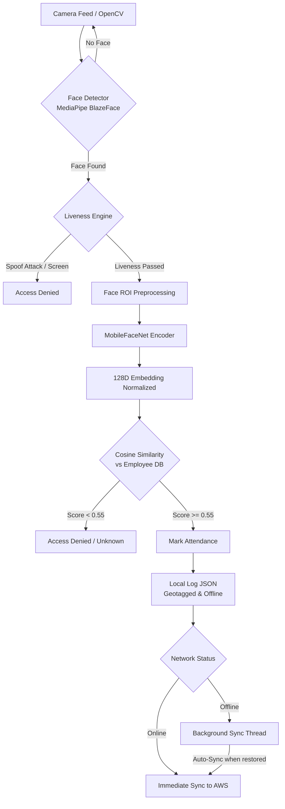

# Datalake 3.0 - Face Recognition & Liveness Verification System
*Developed for the NHAI Hackathon (ganeshsinnur/NHAI-hackathon)*

This repository contains the Machine Learning (ML) subsystem of **Datalake 3.0**, an advanced, offline-first, geotagged employee attendance verification system. The system leverages lightweight deep learning models to perform high-speed on-device face detection, recognition, dual-mode liveness verification, and background synchronization to AWS cloud servers.

---

## 🏗️ Subsystem Architecture



---

## 🌟 Core Features

### 1. Dual-Mode Liveness Detection
To prevent spoofing attacks (such as holding up a photo, video, or digital screen), the system offers two distinct verification engines:
*   **Active Liveness Engine (Version 1 - `enroll_person.py` / `recognize_face.py`):**
    *   Prompts the user to turn their head left and right.
    *   Calculates the horizontal span ratio between the nose tip and outer eye boundaries using facial landmarks to confirm three-dimensional head movement.
*   **Passive Liveness Engine (Version 2 - `enroll_person1.py` / `recognize_face1.py`):**
    *   **Texture Analysis:** Inspects the Laplacian variance of the face crop to detect low-frequency printed photos (Variance Threshold $< 100.0$).
    *   **Specular Glare Check:** Evaluates HSV channel highlights to identify digital screen reflections (Glare Threshold $< 5\%$).
    *   **Micro-Movement Check:** Tracks spatial translation of the face center across frames to confirm natural human movement.
    *   **Temporal Stability:** Requires 15 consecutive frames of verified human signature before proceeding.

### 2. Edge AI Model Pipeline
*   **Face Detection:** MediaPipe's lightweight BlazeFace (`blaze_face_short_range.tflite`) outputs tight bounding boxes and 6 2D facial keypoints.
*   **Embedding Generator:** MobileFaceNet (`mobilefacenet.tflite`) takes a resized ($112 \times 112$) normalized face crop and runs inference to produce a highly discriminative 128-dimensional embedding.
*   **Face Matching:** Performs Cosine Similarity comparison (dot product of normalized vectors) against the registered employee database with a threshold of $0.55$.

### 3. Location Geotagging (Geofencing Support)
*   **Auto-IP Geolocation:** Contacts `ip-api.com` to capture latitude, longitude, city, region, and country parameters.
*   **Manual Override:** Fallback option enabling coordinate input (e.g. for testing specific NHAI site boundaries).
*   **Hardcoded Default:** Automatically defaults to New Delhi coordinates ($28.6139$, $77.2090$) in complete sandbox isolation.

### 4. Offline-First Syncing
*   Attendance logs are written locally to `attendance_log.json` instantly with a `synced: false` flag.
*   A daemonized background thread polls connection status and auto-uploads pending logs to AWS endpoints every 30 seconds once a connection is detected.
*   If online during recognition, an immediate upload is attempted to minimize latency.

### 5. Employee Management & Security
*   **Admin Authentication:** Secure command-line authentication utilizing SHA-256 hashed password stored in `admin_config.json`.
*   **Duplicate Registration Blocker:** Employs a strict cross-similarity threshold ($0.75$) when enrolling new faces to prevent registering the same user under multiple IDs.
*   **Database Admin Actions:** Restricted operations (e.g. employee deletion, manual sync triggers, and AWS server URL reconfiguration) require admin credentials.

---

## 📂 Project Structure

```bash
ml/
├── blaze_face_short_range.tflite  # MediaPipe face detector weights
├── mobilefacenet.tflite          # MobileFaceNet feature extractor weights
├── enroll_person.py               # V1 Enrollment script (Active Liveness)
├── recognize_face.py              # V1 Verification script (Active Liveness)
├── enroll_person1.py              # V2 Enrollment (Passive Liveness + Duplicate Blocker)
├── recognize_face1.py             # V2 Verification (Passive Liveness + Location + Auto-Sync)
├── test_mediapipe.py              # Simple environment test script
├── admin_config.json              # [Generated] Hashed admin credentials
├── employee_db.json               # [Generated] Employee database (Embeddings)
├── attendance_log.json            # [Generated] Offline-first attendance logs
└── app_config.json                # [Generated] Settings including AWS Server URL
```

---

## 🛠️ Installation & Setup

### 1. Prerequisites
Ensure you have **Python 3.8+** installed. You will need a webcam attached to your machine for execution.

### 2. Dependency Installation
Create a virtual environment (optional but recommended) and install the necessary dependencies:

```bash
# Set up virtual environment
python -m venv env
env\Scripts\activate

# Install required dependencies
pip install numpy opencv-python tensorflow mediapipe requests
```

---

## 🚀 Execution & Usage

### ⚙️ Version 2: Complete Attendance & Management Suite (Recommended)

#### Step 1: Initialize Admin Account
Run the employee management suite. If it is the first run, it will automatically prompt you to set up an admin username and password:
```bash
python enroll_person1.py
```
This script opens a menu offering options to:
1.  **Enroll New Employee:** Calibrates passive liveness, captures 25+ face embedding samples, averages them to build a robust template, checks for duplicates, and saves them.
2.  **List All Registered Employees:** View the IDs, names, and phone numbers.
3.  **Delete Employee:** Requires admin authentication to delete a record permanently.
4.  **Change Admin Password:** Re-authenticates and updates admin credentials.

#### Step 2: Run Verification and Synchronization
Launch the main attendance terminal:
```bash
python recognize_face1.py
```
*   Upon startup, the script resolves your location and tests your internet connection.
*   It displays a live camera feed. Position your face in front of the camera.
*   The **Fast Passive Liveness Engine** runs checks in the background (stable green box indicates liveness verification).
*   Once liveness is verified, it attempts to match your face with the database.
*   Upon successful match, it registers your attendance locally and schedules a background sync to the cloud.
*   **Menu Options:** Press `R` to reset/trigger a new check, `2` to view logs, `3` to manually sync, and `4` to set/update the AWS API gateway URL.

---

### 🧪 Version 1: Legacy Scripts (Active Head-Rotation Liveness)

For scenarios requiring active verification:
*   **Enrolling:** `python enroll_person.py`
    *   Instructs user to face center, turn left, and turn right before capturing face templates.
*   **Verifying:** `python recognize_face.py`
    *   Verifies head rotation liveness, matches the user, and records logs local to the folder.

---

## 💾 Data Schemas

### `employee_db.json`
Stores registration templates. The embedding array contains 128 elements.
```json
{
  "EMP_ID_101": {
    "name": "Jane Doe",
    "phone": "9876543210",
    "embedding": [0.0345, -0.0122, ..., 0.0891]
  }
}
```

### `attendance_log.json`
Geotagged attendance entries.
```json
{
  "employee_id": "EMP_ID_101",
  "name": "Jane Doe",
  "timestamp": "2026-05-28T13:22:28.548439",
  "date": "2026-05-28",
  "time": "13:22:28",
  "latitude": 28.6189,
  "longitude": 77.3262,
  "location": "Gharroli, Delhi (28.6189, 77.3262)",
  "city": "Gharroli",
  "region": "Delhi",
  "country": "India",
  "synced": false
}
```
