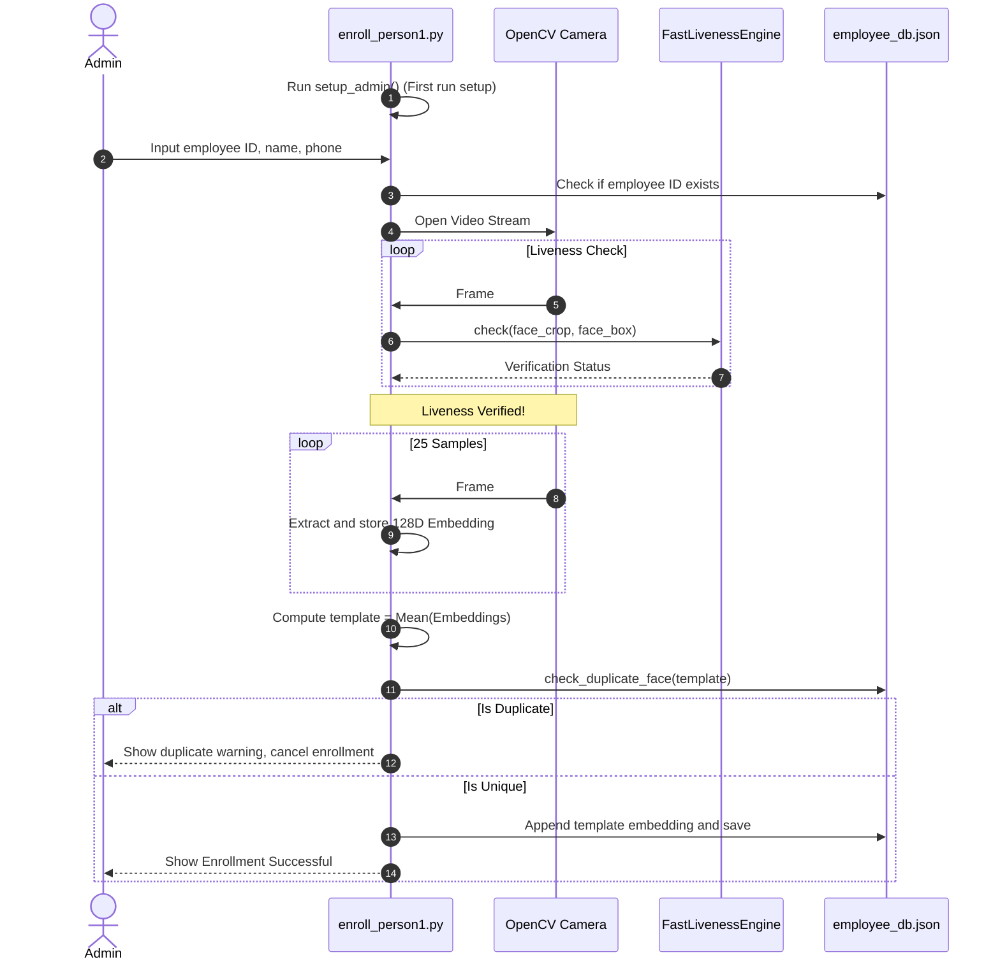
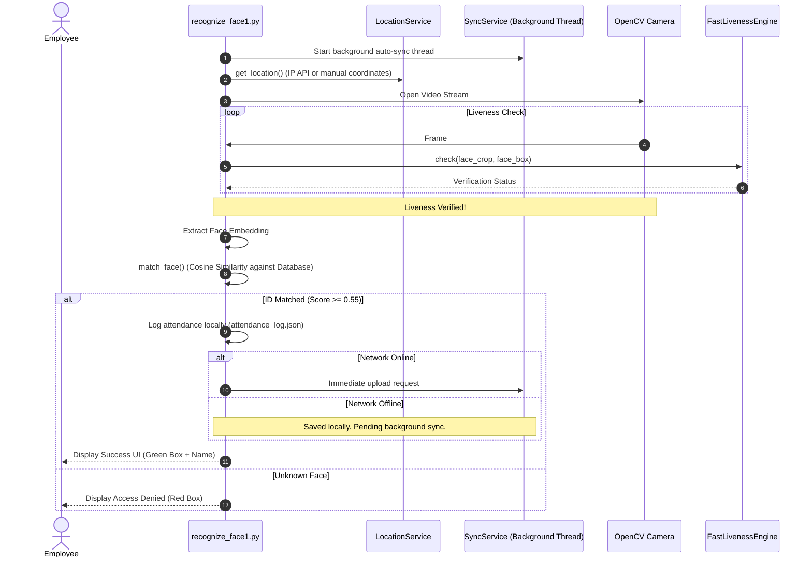

# Detailed Functional Documentation: enroll_person1.py & recognize_face1.py
*Subsystem Version: 2.0 (Datalake Employee Attendance & Management Suite)*

This document provides a comprehensive explanation of the classes, functions, and logic implemented in [enroll_person1.py](file:///c:/Users/Kali/Desktop/Hackathon_ML/ml/enroll_person1.py) and [recognize_face1.py](file:///c:/Users/Kali/Desktop/Hackathon_ML/ml/recognize_face1.py).

---

## 🔑 Shared Components

Both files share a set of core utilities and deep learning pipelines to ensure consistency between enrollment and verification.

### 1. FastLivenessEngine (Class)
Implements a non-intrusive **Passive Liveness Detection** check to ensure a live human is in front of the camera, preventing screen and paper print attacks.

*   `__init__(self, required_stable_frames=15)`: Initializes thresholds:
    *   `min_texture_variance = 100.0` (Variance of Laplacian)
    *   `max_glare_ratio = 0.05` (Specular glare threshold in HSV space)
    *   `min_movement = 2.0` (Minimum cumulative drift of face center to show life)
    *   `max_movement = 80.0` (Maximum drift to filter out sudden camera shifts)
    *   `required_stable_frames = 15`: Number of consecutive frames that must pass texture and glare checks.
*   `reset(self)`: Resets frame counters, movements, and positions.
*   `check_texture(self, face_crop)`: Converts face crop to grayscale, calculates the Laplacian variance. Higher variance indicates rich texture (3D skin structure), while low variance ($< 100.0$) indicates flat paper prints or soft images.
*   `check_glare(self, face_crop)`: Splits HSV representation of the face crop. Calculates the ratio of pixels with value $V > 240$. A ratio $> 5\%$ indicates glare, which is typical of digital screen displays.
*   `check_micro_movement(self, face_box)`: Computes Euclidean distance between the center coordinates of the current face bounding box and the last recorded position. Accumulates the value to verify structural movement.
*   `check(self, face_crop, face_box)`: Coordinates the checks. If texture and glare conditions are met, `stable_count` increments. Once `stable_count` matches `required_stable_frames`, returns `VERIFIED`. Otherwise, returns granular status codes (`SPOOF_DETECTED`, `SPOOF_SUSPECT`, `SCREEN_DETECTED`, or `CHECKING`).

### 2. Deep Learning Feature Extractor (MobileFaceNet)
Used to generate normalized 128D feature vectors representing the identity of a face.
*   `preprocess(face)`: Resizes face crop to $112 \times 112$ pixels, converts from BGR to RGB, normalizes values from $[0, 255]$ to $[-1.0, 1.0]$, and adds a batch dimension.
*   `get_embedding(face)`: Binds preprocessed array to TensorFlow Lite interpreter input, invokes inference, retrieves output, and normalizes it to unit length ($L_2$ norm) so that cosine similarity can be calculated via a dot product.

### 3. Hashed Administration Utility
*   `hash_password(password)`: Generates a secure SHA-256 hash of the plain-text password for comparison.
*   `admin_login()`: Intercepts actions that require authorization (e.g. employee deletion, manual sync), prompts for Username and Password via CLI, and compares hashes. Allows up to 3 attempts.

---

## 📝 1. enroll_person1.py - Detailed Functionality

The enrollment script handles administrator creation, new employee onboarding, face template building, and duplicate registration blocking.

### Script Workflow

### Key Functions
*   `setup_admin()`: Executes on script startup. Checks for the existence of `admin_config.json`. If missing, prompts the user to define username/password configurations to secure future actions.
*   `change_admin_password()`: Authenticates the admin and writes a new SHA-256 password hash.
*   `load_db()` / `save_db(db)`: Reads and writes the `employee_db.json` database.
*   `check_duplicate_face(new_embedding, db, threshold=0.75)`: Computes the dot product (cosine similarity) between the new face template and every embedding registered in the database. If a match exceeds $0.75$, the function flags it as duplicate to prevent registering a person under multiple identities.
*   `delete_employee(emp_id)`: Deletes an employee from the database. **Requires admin authentication.**
*   `list_employees()`: Displays a formatted list of all registered employee IDs, names, and phone numbers.
*   `enroll()`: Performs the core registration:
    1.  Prompts for ID, Name, and Phone number.
    2.  Spins up camera, detects face boundaries, and routes frames to `FastLivenessEngine`.
    3.  Once liveness is verified, captures a minimum of 25 frames.
    4.  Extracts embeddings, calculates the mean vector (creating a stable centroid template), and normalizes it.
    5.  Performs the duplicate check. If clear, registers the employee data to `employee_db.json`.
*   `main_menu()`: Renders the administrator dashboard options loop.

---

## 📝 2. recognize_face1.py - Detailed Functionality

The verification script handles offline attendance logging, background cloud synchronization, location geotagging, and server settings.

### Script Workflow

### Key Classes & Methods

#### LocationService (Class)
Resolves physical coordinates of the device during attendance logging.
*   `get_location()`: Sends an HTTP GET request to IP-API (`http://ip-api.com/json/`). If online, parses JSON response returning latitude, longitude, city, region, and country. Falls back to manual input or default coordinates ($28.6139$, $77.2090$) in offline scenarios.
*   `get_manual_location()`: CLI coordinate prompt for testing location boundaries.
*   `format_location(loc)`: Returns a display-friendly coordinates and city string.

#### SyncService (Class)
Coordinates offline-first logging data sync to AWS API Gateways.
*   `load_server_url()` / `save_server_url(url)`: Manages persistent config file `app_config.json`.
*   `check_internet()`: Pings DNS servers (`8.8.8.8` / `1.1.1.1`) to check if Internet is available.
*   `sync_pending_logs()`: Filters `attendance_log.json` for records where `synced` is `false`. Iteratively attempts to upload them.
*   `upload_single_log(log)`: Posts payload JSON to the AWS API Gateway URL. If response is $200$ or $201$, returns `True`.
*   `start_background_sync()`: Spawns a daemon thread (`_sync_loop`) running every 30 seconds to upload files asynchronously.
*   `stop_background_sync()`: Stops loop execution on program shutdown.
*   `manual_sync()`: **Requires admin auth.** Initiates immediate upload of unsynced entries.

### Key Functions
*   `match_face(embedding, db)`: Compares candidate embedding vector against database using dot product. Returns target employee ID and matching score if similarity exceeds $0.55$.
*   `log_attendance(emp_id, name, location)`: Appends a JSON record containing timestamps, location metadata, coordinates, and sync status to `attendance_log.json`.
*   `view_attendance_logs()`: Parses local JSON and prints formatted log tables, highlighting syncing status (Synced/Pending).
*   `sync_attendance(sync_service)`: Handles CLI verification to initiate administrative sync, and offers option to purge synced logs.
*   `configure_server(sync_service)`: Updates target API endpoints. **Requires admin authentication.**
*   `run(sync_service)`: Executes camera loop, performs location tagging, checks liveness, runs face matches, outputs success/unknown indicators, logs local attendance data, and calls immediate sync.
*   `main_menu()`: Renders the employee verification terminal dashboard.
